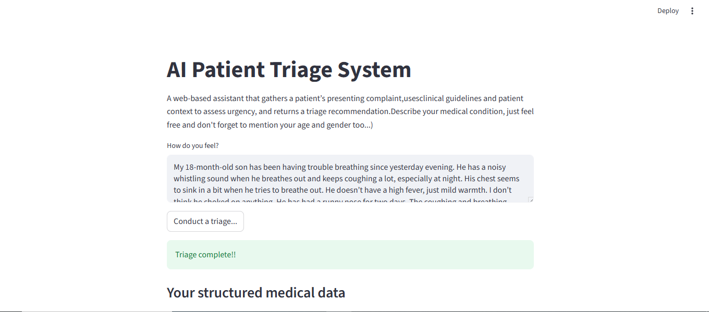
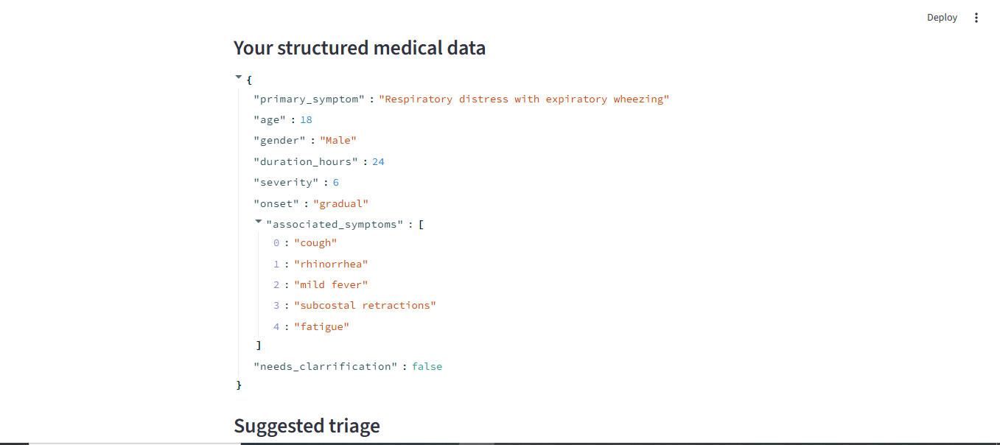
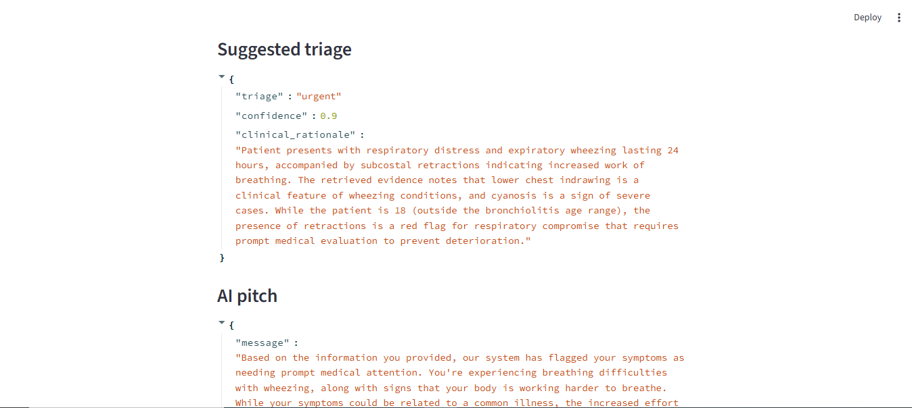
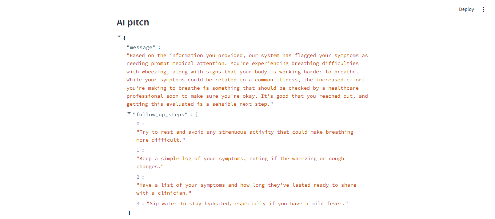

# AI Clinical Triage System

This project is an AI-powered triage assistant designed to collect patient information, and classify medical cases based on clinical guidelines. It supports free-text patient reports and returns structured insights that help clinicians or digital health systems make faster decisions.

The system can:

- Parse natural text and extract key clinical fields.
- Classify cases using clinical rules and AI reasoning.
- Provide recommended next steps based on guidelines.

---

## Features

### Intelligent Symptom Extraction
Extracts relevant clinical indicators such as wheeze, cough, fever, chest indrawing and onset patterns.

### Clinical Case Classification
Distinguishes between bronchiolitis, pneumonia, asthma, foreign body and viral-induced wheeze.

### Modular LangGraph Architecture
Easily extendable with new nodes, rules or conditions.

---

## Tech Stack

- Python  
- LangGraph  
- LangChain  
- OpenAI models  
- Streamlit (for UI testing)  

---

## Sample test

